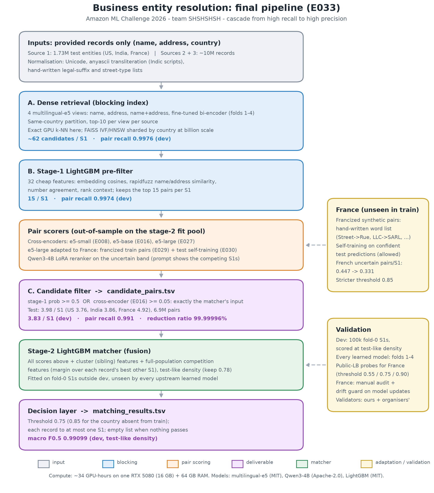

# Amazon ML Challenge 2026: business entity resolution (team SHSHSHSH)

Team SHSHSHSH. 72-hour hackathon, 25-27 Sep 2026.

**Task:** for every Source-1 business record, find its matching records in Sources 2 and 3 (name, address, country;
US and India in train, plus France only in test). Outputs: `matching_results.tsv`, scored by macro F0.5 per S1 entity,
and `candidate_pairs.tsv`, the candidate set fed to the matching model (smaller sets rank higher).

**Approach (final, E033):** same-country dense retrieval over four multilingual-e5 views (one a fine-tuned
bi-encoder), a stage-1 LightGBM filter, three fine-tuned cross-encoders (e5 small/base/large), a Qwen3-4B LoRA
reranker that sees competing S1s, and a stage-2 LightGBM with full-population competition features at test-like
density, followed by a precision-first decision layer (threshold 0.75, 0.85 for the country absent from train, one S1
per record). France is handled by test-time self-training and francized synthetic training pairs, both built only
from the provided data. Details: [docs/Documentation_template.md](docs/Documentation_template.md); rebuild both TSVs
with [scripts/reproduce.sh](scripts/reproduce.sh) ([docs/REPRODUCE.md](docs/REPRODUCE.md)).



## Current best
| | Dev F0.5 (test-like density) | Public LB | Candidates / S1 (test) | Experiment | Tag |
|---|---|---|---|---|---|
| Final | 0.99099 (OOF 0.99100) | final upload | 3.98 (RR 99.99996%, dev recall 0.991) | E033 | `sub-16` |
| Best measured LB | 0.99100 | **0.986359** | 4.74 | E023b-full, France threshold 0.90 | `sub-14` |

History of every experiment: [docs/EXPERIMENTS.md](docs/EXPERIMENTS.md); every upload: [docs/SUBMISSIONS.md](docs/SUBMISSIONS.md).

## Quick start
```bash
# 1. Setup (Windows: .venv\Scripts\activate · WSL/Linux: source .venv/bin/activate)
python -m venv .venv && .venv\Scripts\activate
pip install -r requirements.txt        # GPU stack (CUDA 12.8 wheels). Cloud/CPU-only: requirements-core.txt
copy .env.example .env                 # set DATA_DIR, DISCORD_WEBHOOK_URL (never commit .env)
python scripts/check_env.py            # verifies GPU (sm_120), bf16, libraries
python -m pytest                       # all tests run on synthetic data

# 2. Train (terminal 1) and monitor (terminal 2)
python -m monitor.launch --run E001-baseline -- python -m src.train_template --cfg configs/example.yaml
python -m monitor.watch --run E001-baseline

# 3. Predict → validate → tag → submit
python -m src.submission validate submissions/E001.csv --sample data/sample_submission.csv
python scripts/tag_submission.py submissions/E001.csv --exp E001-baseline --cv <cv> --sample data/sample_submission.csv

# 4. Final code zip (from committed files only)
python scripts/make_submission_zip.py --predictions <final.csv> --sample <sample.csv> --doc <approach.pdf>
```

## Repository structure
```
configs/    YAML configs: base.yaml + one per experiment (E###-name.yaml)
src/        metrics, CV folds, OOF storage, submission writer/validator, config, seeding, training template
monitor/    Heartbeat (import in training), watchdog dashboard + Discord/ntfy alerts, launcher, demo
scripts/    environment check, submission tagging, final zip builder
tests/      pytest suite (no GPU or real data needed)
notebooks/  EDA
docs/       competition facts, playbook, logs (see below)
```
`data/`, `runs/`, `checkpoints/`, `oof/`, `submissions/`, `dist/`, and `.env` are gitignored.

## Documentation
| Doc | Purpose |
|---|---|
| [CLAUDE.md](CLAUDE.md) | Working rules for the team and for Claude Code |
| [docs/COMPETITION.md](docs/COMPETITION.md) | Rules, metric, data schema, limits, deadlines |
| [docs/PLAYBOOK_72H.md](docs/PLAYBOOK_72H.md) | Hour-by-hour plan and strategies for each problem type |
| [docs/EXPERIMENTS.md](docs/EXPERIMENTS.md) | Every experiment: config, CV, LB, runtime |
| [docs/SUBMISSIONS.md](docs/SUBMISSIONS.md) | Submission ledger with git tags |
| [docs/DECISIONS.md](docs/DECISIONS.md) | Key decisions and why we made them |
| [docs/DAILY_LOG.md](docs/DAILY_LOG.md) | Progress summaries and the GPU queue |
| [docs/SUBMISSION_CHECKLIST.md](docs/SUBMISSION_CHECKLIST.md) | Pre-submit checks and the approach-doc template |
| [docs/TEAM.md](docs/TEAM.md) | Roles, branches, how we share OOF predictions |
| [docs/HARDWARE.md](docs/HARDWARE.md) | RTX 5080 setup, limits, WSL2 |
| [docs/AWS_SAGEMAKER.md](docs/AWS_SAGEMAKER.md) | When and how to use AWS, and how to control cost |
| [monitor/README.md](monitor/README.md) | Training monitor and alerts |

## Reproducibility
Each leaderboard submission has a git tag (`sub-NN`) recorded in `docs/SUBMISSIONS.md`. Each experiment has
a config, a seed, and saved out-of-fold predictions. To rebuild the final submission, check out tag `final`
and follow Quick start.
